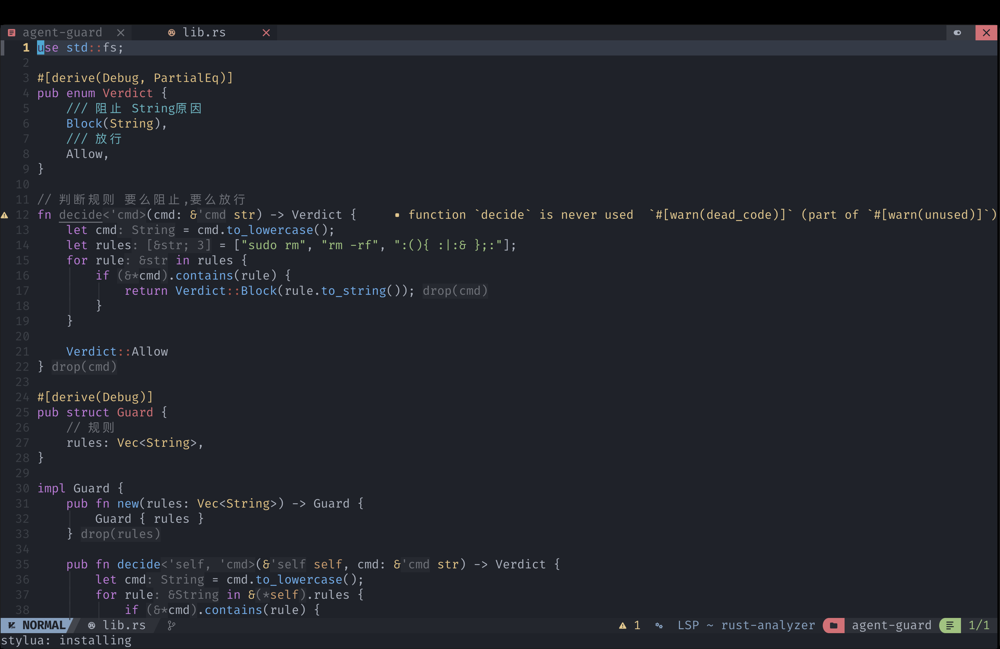

<div align="center">

# 🦀 rusty-nvim

**A batteries-included Neovim configuration for Rust development.**

Built on NvChad · rustaceanvim · blink.cmp · LuaSnip · nvim-dap

</div>

<div align="center">

[](https://neovim.io)
[](https://www.rust-lang.org)
[](./LICENSE)
[](./luasnippets/rust.lua)

[](https://github.com/lisering/rusty-nvim/stargazers)
[](https://github.com/lisering/rusty-nvim/commits)
[](https://github.com/lisering/rusty-nvim)
[](https://github.com/lisering/rusty-nvim/issues)
[](#-prerequisites)

**[English](./README.md)** · **[中文](./README_zh.md)**

</div>

---

## 📖 Table of Contents

- [✨ Features](#-features)
- [📸 Preview](#-preview)
- [📋 Prerequisites](#-prerequisites)
- [🚀 Installation](#-installation)
- [🗑 Uninstallation](#-uninstallation)
- [⚡ Quick Start](#-quick-start)
- [🎬 Practical Examples](#-practical-examples)
- [⌨ Full Keymap Reference](#-full-keymap-reference)
- [📝 Snippet Catalog](#-snippet-catalog)
- [📁 Directory Structure](#-directory-structure)
- [🔧 Customization](#-customization)
- [❓ FAQ](#-faq)
- [🙏 Credits](#-credits)

---

## ✨ Features

| | Feature | Description |
|:---:|---------|-------------|
| 🎯 | **Zero-config** | Clone and launch — Mason auto-installs `rust-analyzer`, `codelldb`, and formatters |
| 🧠 | **Smart completion** | `blink.cmp` + `LuaSnip` — Tab to navigate list, Tab to jump snippet placeholders, LSP/snippet dedup |
| 🦀 | **Full LSP** | `rustaceanvim`: memory layout hover, clippy diagnostics, code lens, macro expand, joinLines |
| 🔨 | **Save-to-rerun** | `<leader>rr` starts `cargo run`; saving `.rs` auto-restarts the process |
| 🐛 | **Debugging** | `codelldb` integration, cross-platform (macOS / Linux / Windows / WSL) |
| 🧪 | **Test integration** | `neotest` + rustaceanvim adapter — single-key run / debug nearest test |
| 📦 | **Dependency management** | `crates.nvim`: upgrade / downgrade / view features in `Cargo.toml` |
| 📝 | **269 Rust snippets** | Stdlib macros, fn defs, control flow, iterator chains, design patterns, unsafe/FFI, tokio async, serde, trait impls, error types, closures, generics, memory ops |
| 🔍 | **Global search** | Telescope + ripgrep + LSP symbols / references / call hierarchy |
| 📊 | **Diagnostics panel** | `trouble.nvim` for workspace diagnostics, references, call chain |
| 🌳 | **Treesitter** | Code object select / jump / swap |
| 💅 | **Beautiful UI** | NvChad theming, cursor line bar, inlay hints, semantic highlighting |

---

## 📸 Preview

<p align="center">
  <em>Editing a Rust source file</em><br>
  
</p>

<p align="center">
  <em>Save & auto-rerun cargo run</em><br>
  
</p>

<p align="center">
  <em>Snippet expansion & Tab navigation</em><br>
  
</p>

---

## 📋 Prerequisites

### Required — must install manually

| Dependency | Min Version | macOS | Ubuntu / Debian | Fedora | Arch |
|:-----------|:-----------:|:------|:----------------|:-------|:-----|
| [Neovim](https://github.com/neovim/neovim) | **0.10+** | `brew install neovim` | [Guide](https://github.com/neovim/neovim/wiki/Installing-Neovim) | `dnf install neovim` | `pacman -S neovim` |
| [Rust toolchain](https://rustup.rs) | stable | `curl --proto '=https' --tlsv1.2 -sSf https://sh.rustup.rs \| sh` | same | same | same |
| [ripgrep](https://github.com/BurntSushi/ripgrep) | any | `brew install ripgrep` | `apt install ripgrep` | `dnf install ripgrep` | `pacman -S ripgrep` |
| [git](https://git-scm.com) | 2.20+ | `brew install git` | `apt install git` | `dnf install git` | `pacman -S git` |
| **Nerd Font** | any | `brew install --cask font-jetbrains-mono-nerd-font` | [Download](https://www.nerdfonts.com/font-downloads) | same | same |

> ⚠ **You must install a Nerd Font and set it as your terminal font**, otherwise icons will show as boxes.

<details>
<summary>📦 Quick install all dependencies (click to expand)</summary>

**macOS:**
```bash
brew install neovim ripgrep git fd node
brew install --cask font-jetbrains-mono-nerd-font
curl --proto '=https' --tlsv1.2 -sSf https://sh.rustup.rs | sh
```

**Ubuntu / Debian:**
```bash
sudo apt update
sudo apt install -y ripgrep git fd-find nodejs
# Neovim 0.10+ may need PPA or AppImage:
curl -LO https://github.com/neovim/neovim/releases/latest/download/nvim-linux-x86_64.appimage
chmod u+x nvim-linux-x86_64.appimage
sudo mv nvim-linux-x86_64.appimage /usr/local/bin/nvim
curl --proto '=https' --tlsv1.2 -sSf https://sh.rustup.rs | sh
```

**Fedora:**
```bash
sudo dnf install -y neovim ripgrep git fd-find nodejs
curl --proto '=https' --tlsv1.2 -sSf https://sh.rustup.rs | sh
```

**Arch:**
```bash
sudo pacman -S --needed neovim ripgrep git fd nodejs rustup
rustup default stable
```

</details>

### Recommended

| Dependency | Purpose | Install |
|:-----------|:--------|:--------|
| [fd](https://github.com/sharkdp/fd) | Faster Telescope file search | `brew install fd` / `apt install fd-find` |
| [Node.js](https://nodejs.org) 18+ | Some Mason packages depend on it | `brew install node` / `apt install nodejs` |

### Auto-installed (no manual action needed)

Installed by `mason-tool-installer` 3 seconds after first launch:

| Tool | Purpose |
|:-----|:--------|
| `rust-analyzer` | Rust language server (LSP) |
| `codelldb` | Rust debugger (DAP) |
| `stylua` | Lua formatter |
| `taplo` | TOML formatter |
| `biome` | JSON formatter |

---

## 🚀 Installation

### Option A: One-liner (recommended)

```bash
curl -fsSL https://raw.githubusercontent.com/lisering/rusty-nvim/main/install.sh | bash
```

### Option B: Clone + Run Script

```bash
git clone https://github.com/lisering/rusty-nvim.git ~/.config/nvim
cd ~/.config/nvim && bash install.sh
```

### Option C: Manual

```bash
# Backup existing config
mv ~/.config/nvim ~/.config/nvim.bak 2>/dev/null || true

# Clone
git clone https://github.com/lisering/rusty-nvim.git ~/.config/nvim

# Launch — plugins auto-install on first run
nvim
```

<details>
<summary>🖥 Windows / WSL instructions</summary>

**WSL (recommended for Windows users):**

```bash
wsl --install
# Inside WSL:
sudo apt update && sudo apt install -y ripgrep git fd-find
curl --proto '=https' --tlsv1.2 -sSf https://sh.rustup.rs | sh
# Install Neovim 0.10+ via AppImage (see Prerequisites)
git clone https://github.com/lisering/rusty-nvim.git ~/.config/nvim
nvim
```

**Native Windows** (experimental — paths use `%LOCALAPPDATA%\nvim`):

```powershell
git clone https://github.com/lisering/rusty-nvim.git "$env:LOCALAPPDATA\nvim"
nvim
```

> ⚠ Native Windows is not fully tested. WSL is recommended.

</details>

### First launch timeline

```
Launch nvim
  ├─ lazy.nvim auto-clones all plugins         (~30s)
  ├─ Treesitter auto-installs rust/toml/lua      parsers
  └─ 3s later, mason-tool-installer installs:
      ├─ rust-analyzer
      ├─ codelldb
      ├─ stylua / taplo / biome
      └─ ✅ Done! Open a .rs file and start coding
```

---

## 🗑 Uninstallation

### Option A: One-liner (recommended)

```bash
curl -fsSL https://raw.githubusercontent.com/lisering/rusty-nvim/main/uninstall.sh | bash
```

### Option B: Clone + Run Script

```bash
cd ~/.config/nvim && bash uninstall.sh
```

To skip the confirmation prompt:

```bash
bash uninstall.sh --force
```

### Option C: Manual

```bash
rm -rf ~/.config/nvim{,.bak}
rm -rf ~/.local/share/nvim{,.bak}
rm -rf ~/.local/state/nvim{,.bak}
rm -rf ~/.cache/nvim{,.bak}
```

> This removes the config, plugins, cache, state, and all backups. Neovim itself is not uninstalled.

---

## ⚡ Quick Start

After installation, verify everything works in 60 seconds:

```bash
# 1. Create a Rust project
cargo new hello_rusty && cd hello_rusty

# 2. Open in Neovim
nvim src/main.rs

# 3. Wait ~10s for rust-analyzer to index (watch the statusline)

# 4. Try these keys:
#    K          → hover (type info + memory layout)
#    <Space>rr  → cargo run (bottom terminal opens)
#    <Space>ca  → code action menu
#    <Space>ff  → find files
#    <Space>fw  → live grep
#    <C-n>      → toggle file tree
```

---

## 🎬 Practical Examples

> `<leader>` = Space

### Example 1: Create a Rust Project from Scratch

```bash
cargo new hello_world
cd hello_world
nvim src/main.rs
```

```rust
// In nvim, editing src/main.rs

// 1. Type "println" → completion menu appears → Enter to accept
//    Expands to: println!("");
//                       ^ cursor here, type format string

// 2. Type "hello world"
println!("hello world");

// 3. Press jk to return to Normal mode
// 4. Press <Space>rr → bottom terminal opens with cargo run
//    Output: hello world

// 5. Modify code → <C-s> to save → terminal auto Ctrl+C and re-runs cargo run
```


---

### Example 2: Write Tests with Snippets

```rust
// 1. Type "testmod" → Enter → expands to full test module:
#[cfg(test)]
mod tests {
    use super::*;

    #[test]
    fn it_works() {
        todo!()
    }
}

// 2. Tab → cursor on "it_works" → rename to "test_add"
// 3. Tab → cursor on "todo!()" → write test logic
// 4. Type "assert_eq" → Enter → expands to:
//    assert_eq!(left, right);
// 5. Tab → cursor on "left" → type 1 + 1
// 6. Tab → cursor on "right" → type 2
// Final result:
#[cfg(test)]
mod tests {
    use super::*;

    #[test]
    fn test_add() {
        assert_eq!(1 + 1, 2);
    }
}

// 7. <Space>tt → run nearest test → neotest shows ✓
```


---

### Example 3: Debug with Breakpoints

```rust
fn factorial(n: u32) -> u32 {
    if n <= 1 {
        1
    } else {
        n * factorial(n - 1)
    }
}

fn main() {
    let result = factorial(5);
    println!("5! = {}", result);
}
```

```
1. Move cursor to "n * factorial(n - 1)" line
2. <Space>db → breakpoint appears (red dot)
3. <Space>dc → start debugging → program stops at breakpoint
4. DAP UI auto-opens: variables panel (left), call stack (bottom)
5. <Space>dj → step over → variables update
6. <Space>dl → step into factorial function
7. <Space>dk → step out
8. <Space>de → terminate debug session
```

---

### Example 4: Diagnose and Fix Errors

```rust
let numbers = vec![1, 2, 3];
let sum: i32 = numbers.sum();  // ← rust-analyzer marks yellow
```

```
1. ]t → jump to next diagnostic
2. K → hover popup → shows error message and fix suggestions
3. <Space>ca → Code Action menu → select a fix

Advanced:
4. <Space>cd → copy diagnostic message to clipboard
5. <Space>xx → open diagnostics panel → see all project issues
6. ]t / [t → navigate through diagnostics panel
```

---

### Example 5: Git Workflow

```
1. <Space>gt → open Git status (Telescope) → see changed files
2. Select file → Enter → jump to file
3. ]h → jump to next modified hunk
4. <Space>hp → preview hunk → diff window pops up
5. <Space>hs → stage that hunk
6. <Space>hr → reset that hunk
7. <Space>hb → view git blame for current line
8. <Space>cm → open Git commit history (Telescope)
```

---

### Example 6: Dependency Management

```toml
# Cargo.toml
[dependencies]
serde = "1.0"       # ← cursor on this line
tokio = "1.0"
```

```
1. Open Cargo.toml → crates.nvim auto-shows latest versions
2. Move cursor to serde line
3. <Space>Cu → upgrade serde to latest
4. <Space>CU → upgrade all dependencies
5. <Space>Cf → view serde's features list
6. <Space>Co → open docs.rs/serde in browser
7. <Space>Cr → open serde's GitHub repo
```

---

### More Scenarios

<details>
<summary>🔍 View Memory Layout with Hover</summary>

```rust
struct User {
    name: String,
    age: u32,
    emails: Vec<String>,
}
```

```
1. Place cursor on "User"
2. K → hover popup appears
   Shows: struct definition + field types
   Bottom: memory layout (size/offset/alignment/padding/niches)
3. <C-f> → scroll documentation down
4. <C-b> → scroll up
5. jk → close hover
```

</details>

<details>
<summary>🔧 Expand Macros</summary>

```rust
// println! is a macro — see what it expands to:
1. Place cursor on println!
2. <Space>re → macro expansion window appears
```

</details>

<details>
<summary>📞 View Call Hierarchy</summary>

```
1. Place cursor on a function name
2. <Space>fI → who calls this function (incoming calls)
3. <Space>fO → what does this function call (outgoing calls)
4. Telescope popup → select entry → jump
```

</details>

<details>
<summary>🌳 Select Functions with Treesitter</summary>

```
1. In Normal mode
2. vaf → visually select entire function (with signature and body)
3. vif → visually select function interior (without signature)
4. ]f → jump to next function
5. [f → jump to previous function
6. <Space>na → swap current parameter with next
```

</details>

---

## ⌨ Full Keymap Reference

> `<leader>` = Space | `<C-x>` = Ctrl+x | `<S-Tab>` = Shift+Tab

### 🔥 Core

| Key | Action |
|:---:|--------|
| `jk` | Exit insert mode |
| `<C-s>` | Save (silent, no hit-enter prompt) |
| `;` | Enter command mode |
| `gd` | Go to definition |
| `K` | Hover — type / docs / memory layout |
| `<leader>ca` | Code Action |
| `<F2>` | Rename (live preview) |
| `<leader>rr` | cargo run (auto-rerun on save) |
| `<leader>rc` | cargo check |
| `<leader>rf` | fly check (clippy instant check) |
| `<leader>rt` | cargo test |
| `<leader>tt` | Run nearest test |
| `<leader>db` | Toggle breakpoint |
| `<leader>dc` | Start / continue debugging |
| `Tab` | Next completion / Snippet placeholder forward |
| `<leader>ff` | Find files |
| `<leader>fw` | Live grep |
| `<C-n>` | Toggle file tree |
| `<leader>/` | Toggle comment |
| `<leader>fm` | Format file |
| `<leader>xx` | Diagnostics panel |
| `<leader>cd` | Copy diagnostics to clipboard |
| `<leader>ra` | Rename (live preview) |
| `]t` / `[t` | Next / prev diagnostic |

### Completion & Snippets

| Key | Action |
|:---:|--------|
| `Tab` | Next completion / Snippet placeholder forward |
| `S-Tab` | Prev completion / Snippet placeholder backward |
| `<CR>` | Accept completion (or newline if menu hidden) |
| `<C-l>` | Force snippet forward (ignores menu visibility) |
| `<C-Space>` | Trigger completion + docs |
| `<C-e>` | Close completion menu |
| `<C-k>` | Signature help |
| `<C-b>` / `<C-f>` | Scroll docs up / down |
| `<C-u>` / `<C-d>` | Scroll signature up / down |

### Code Navigation

| Key | Action |
|:---:|--------|
| `gd` | Go to definition |
| `gD` | Go to declaration |
| `<leader>D` | Go to type definition |
| `<leader>gr` | Find references |
| `<leader>gi` | Find implementations (trait impls) |
| `<leader>fs` | Document symbols |
| `<leader>fS` | Workspace symbols |
| `<leader>fr` | Telescope references |
| `<leader>fI` | Incoming calls (who calls this) |
| `<leader>fO` | Outgoing calls (what does this call) |
| `<leader>rp` | Go to parent module |

### Rust Development

#### Run & Build

| Key | Action |
|:---:|--------|
| `<leader>rr` | cargo run (reuses terminal, auto-rerun on save) |
| `<leader>rq` | Kill cargo terminal |
| `<leader>rc` | cargo check |
| `<leader>rf` | fly check (clippy) |
| `<leader>rt` | cargo test |
| `<leader>rl` | List runnables |

#### Code Intelligence

| Key | Action |
|:---:|--------|
| `<leader>rh` | Hover actions (run / debug / goto) |
| `<leader>re` | Expand macro |
| `<leader>rd` | Open docs.rs |
| `<leader>rx` | Explain error |
| `<leader>rj` | Join lines smartly |
| `<leader>rp` | Go to parent module |
| `<leader>rC` | Open Cargo.toml |
| `<leader>rs` | Syntax tree |
| `<leader>rw` | Reload workspace |
| `<leader>rT` | Related tests |
| `<leader>rR` | Related diagnostics |
| `<leader>rD` | Render diagnostic |
| `<leader>rg` | Debuggables (DAP) |
| `<leader>rmu` | Move item up |
| `<leader>rmd` | Move item down |
| `<leader>ri` | Toggle inlay hints |
| `<leader>ra` | Rename (inc-rename preview) |

### Test & Debug

#### Testing (neotest)

| Key | Action |
|:---:|--------|
| `<leader>tt` | Run nearest test |
| `<leader>tf` | Run all tests in file |
| `<leader>td` | Debug nearest test |
| `<leader>ts` | Test summary panel |
| `<leader>to` | Test output |
| `]T` / `[T` | Next / prev failed test |

#### Debugging (DAP)

| Key | Action |
|:---:|--------|
| `<leader>db` | Toggle breakpoint |
| `<leader>dd` | Conditional breakpoint |
| `<leader>dc` | Start / continue |
| `<leader>dl` | Step into |
| `<leader>dj` | Step over |
| `<leader>dk` | Step out |
| `<leader>de` | Terminate |
| `<leader>dr` | Run last |
| `<leader>dt` | List debuggable testables |

### Diagnostics & Refactoring

| Key | Action |
|:---:|--------|
| `<leader>xx` | Workspace diagnostics panel |
| `<leader>xX` | Buffer diagnostics panel |
| `<leader>cd` | Copy diagnostics to clipboard |
| `]t` / `[t` | Next / prev diagnostic |
| `<leader>ca` | Code Action |
| `<F2>` | Rename (live preview) |
| `<leader>fm` | Format file |
| `<leader>xr` | References panel |
| `<leader>xi` / `<leader>xo` | Call hierarchy (in / out) |
| `<leader>xs` | Symbols panel |
| `<leader>xq` | Quickfix panel |

### Git

| Key | Action |
|:---:|--------|
| `]h` / `[h` | Next / prev hunk |
| `<leader>hs` | Stage hunk |
| `<leader>hr` | Reset hunk |
| `<leader>hp` | Preview hunk |
| `<leader>hb` | Blame line |
| `<leader>hd` | Diff this file |
| `<leader>ht` | Toggle line blame |
| `<leader>gt` | Git status |
| `<leader>cm` | Git commit history |
| `<leader>gb` | Buffer commit history |
| `<leader>gB` | Branch switch |

### Files & Search

| Key | Action |
|:---:|--------|
| `<C-n>` | Toggle file tree |
| `<leader>e` | Focus file tree |
| `<leader>ff` | Find files |
| `<leader>fa` | Find all files (incl. hidden) |
| `<leader>fw` | Live grep |
| `<leader>fb` | Find buffers |
| `<leader>fo` | Recent files |
| `<leader>fz` | Fuzzy search in buffer |

### Windows & Buffers

| Key | Action |
|:---:|--------|
| `<C-h>` / `<C-l>` | Left / right window |
| `<C-j>` / `<C-k>` | Down / up window |
| `<C-w>s` | Horizontal split |
| `<C-w>v` | Vertical split |
| `<C-w>c` | Close window |
| `<C-w>o` | Close other windows |
| `Tab` / `S-Tab` | Next / prev buffer (Normal mode) |
| `<leader>x` | Close buffer |
| `<leader>b` | New buffer |

### Terminal

| Key | Action |
|:---:|--------|
| `<A-i>` | Toggle float terminal |
| `<A-v>` | Toggle vertical terminal |
| `<A-h>` | Toggle horizontal terminal |
| `<leader>h` | New horizontal terminal |
| `<leader>v` | New vertical terminal |
| `<C-x>` | Terminal → Normal mode |

### Crates.nvim (in Cargo.toml)

| Key | Action |
|:---:|--------|
| `<leader>Cu` | Upgrade crate |
| `<leader>CU` | Upgrade all crates |
| `<leader>Cd` | Downgrade crate |
| `<leader>Cf` | Show crate features |
| `<leader>Co` | Open crate docs |
| `<leader>Cr` | Open crate repo |
| `<leader>Ca` | Refresh crate info |

### Treesitter Text Objects

<details>
<summary>📋 Full Treesitter keymaps (click to expand)</summary>

#### Select (visual / operator-pending)

| Key | Object |
|:---:|--------|
| `af` / `if` | Function (with / without signature) |
| `ac` / `ic` | Class |
| `aa` / `ia` | Parameter |
| `al` / `il` | Loop |
| `ab` / `ib` | Block |
| `aC` / `iC` | Comment |
| `am` / `im` | Call |
| `as` | Statement |

#### Jump

| Key | Target |
|:---:|--------|
| `]f` / `[f` | Next / prev function |
| `]k` / `[k` | Next / prev class |
| `]a` / `[a` | Next / prev parameter |
| `]l` / `[l` | Next / prev loop |
| `]s` / `[s` | Next / prev statement |
| `]m` / `[m` | Next / prev call |

#### Swap

| Key | Action |
|:---:|--------|
| `<leader>na` | Swap parameter (forward) |
| `<leader>nf` | Swap function (forward) |
| `<leader>nk` | Swap class (forward) |
| `<leader>Na` | Swap parameter (backward) |
| `<leader>Nf` | Swap function (backward) |
| `<leader>Nk` | Swap class (backward) |

#### Surround (mini.surround)

| Key | Action |
|:---:|--------|
| `sa{char}` | Add surround (e.g. `sa"` adds quotes) |
| `sd{char}` | Delete surround |
| `sr{old}{new}` | Replace surround |
| `sf{char}` | Find right surround |
| `sF{char}` | Find left surround |
| `sh{char}` | Highlight surround |

</details>

> Full keymap cheat sheet: [KEYMAPS.md](KEYMAPS.md)

---

## 📝 Snippet Catalog

> Type trigger → Enter to accept → Tab to jump placeholders → S-Tab to go back
>
> Only Rust snippets are loaded. Other language snippets (friendly-snippets, VSCode, snipmate) are disabled.

### Stdlib Macros

| Trigger | Expands to |
|---------|-----------|
| `println` | `println!("");` (cursor in quotes) |
| `printlnf` | `println!("", args);` (two placeholders) |
| `eprintln` | `eprintln!("");` |
| `dbg` | `dbg!();` |
| `assert_eq` | `assert_eq!(left, right);` (Tab jumps left→right) |
| `assert_ne` | `assert_ne!(left, right);` |
| `vec` | `vec![];` |
| `format` | `format!("")` |
| `todo` | `todo!()` |
| `panic` | `panic!("");` |
| `matches` | `matches!(expr, pattern)` |
| `cfg` | `cfg!()` |
| `env` | `env!("")` |
| `include_str` | `include_str!("")` |

### Attributes

| Trigger | Expands to |
|---------|-----------|
| `derive` | `#[derive()]` |
| `derive_debug` | `#[derive(Debug)]` |
| `derive_clone` | `#[derive(Clone)]` |
| `derive_copy` | `#[derive(Copy, Clone)]` |
| `derive_default` | `#[derive(Default)]` |
| `derive_eq` | `#[derive(PartialEq, Eq)]` |
| `derive_serde` | `#[derive(serde::Serialize, serde::Deserialize)]` |
| `derive_all` | `#[derive(Debug, Clone, PartialEq, Eq, Hash)]` |
| `inline` | `#[inline]` |
| `must_use` | `#[must_use]` |
| `no_std` | `#![no_std]` |

### Function Definitions

| Trigger | Expands to |
|---------|-----------|
| `fn` | `fn name(args) -> Ret { todo!() }` (4 placeholders) |
| `pfn` | `pub fn name(args) -> Ret { todo!() }` |
| `afn` | `async fn name(args) -> Ret { todo!() }` |
| `pafn` | `pub async fn name(args) -> Ret { todo!() }` |
| `main` | `fn main() { }` |
| `extern_fn` | `extern "C" fn name(...) -> RetType { }` |
| `unsafe_fn` | `unsafe fn name(...) -> Ret { }` |
| `resultfn` | `fn name() -> Result<T, E> { }` |
| `optionfn` | `fn name() -> Option<T> { }` |

### Type Definitions

| Trigger | Expands to |
|---------|-----------|
| `struct` | `#[derive(Debug)] struct Name { field: Type }` |
| `struct_tuple` | `struct Name(Type);` |
| `struct_unit` | `struct Name;` |
| `enum` | `#[derive(Debug)] enum Name { Variant1, Variant2 }` |
| `impl` | `impl Type { }` |
| `trait` | `trait Name { }` |
| `traitimpl` | `impl Trait for Type { }` |
| `mod` | `mod name { }` |
| `const` | `const NAME: Type = init;` |
| `typealias` | `type Alias = Type;` |
| `error_enum` | `#[derive(Debug, thiserror::Error)] enum Error { }` |

### Control Flow

| Trigger | Expands to |
|---------|-----------|
| `if` | `if condition { todo!() }` |
| `iflet` | `if let Some(x) = expr { todo!() }` |
| `while` | `while condition { todo!() }` |
| `for` | `for pat in expr { todo!() }` |
| `loop` | `loop { }` |
| `match` | `match expr { Pattern => todo!(), _ => todo!() }` |
| `match_opt` | `match expr { Some(x) => ..., None => ... }` |
| `match_res` | `match expr { Ok(val) => ..., Err(e) => ... }` |
| `unsafe_block` | `unsafe { }` |

### Testing

| Trigger | Expands to |
|---------|-----------|
| `test` | `#[test] fn name() { todo!() }` |
| `testmod` | `#[cfg(test)] mod tests { use super::*; #[test] fn it_works() { } }` |
| `tokiotest` | `#[tokio::test] async fn name() { }` |

### Error Handling

| Trigger | Expands to |
|---------|-----------|
| `some` / `none` | `Some()` / `None` |
| `ok` / `err` | `Ok()` / `Err()` |
| `context` | `.context("")` |
| `with_context` | `.with_context(\|\| "")?` |
| `map_err` | `.map_err(\|e\| todo!())` |
| `unwrap_or` | `.unwrap_or(default)` |
| `question` | `?` |
| `anyhow_result` | `anyhow::Result<T>` |
| `anyhow_bail` | `anyhow::bail!("msg");` |
| `anyhow_ensure` | `anyhow::ensure!(cond, "msg");` |

### Collections

| Trigger | Expands to |
|---------|-----------|
| `hashmap` | `let mut map: HashMap<Key, Value> = HashMap::new();` |
| `btreemap` | `let mut map: BTreeMap<Key, Value> = BTreeMap::new();` |
| `hashset` | `let mut set: HashSet<T> = HashSet::new();` |
| `vecnew` | `let v: Vec<T> = Vec::new();` |
| `entry` | `.entry(key).or_insert(default)` |

### Iterator Chains

| Trigger | Expands to |
|---------|-----------|
| `itermap` | `.iter().map(\|x\| todo!())` |
| `iterfilter` | `.iter().filter(\|x\| todo!())` |
| `iterfold` | `.iter().fold(init, \|acc, x\| todo!())` |
| `itercollect` | `.iter().collect::<Vec<_>>()` |
| `iterenum` | `.iter().enumerate()` |
| `iterzip` | `.iter().zip(other)` |
| `iterany` | `.iter().any(\|x\| todo!())` |
| `iterall` | `.iter().all(\|x\| todo!())` |
| `itersum` | `.iter().sum::<T>()` |
| `itermax` | `.iter().max()` |

### Concurrency

| Trigger | Expands to |
|---------|-----------|
| `arc` | `Arc::new(value)` |
| `arcmutex` | `Arc::new(Mutex::new(value))` |
| `channel` | `let (tx, rx) = mpsc::channel();` |
| `send` | `tx.send(value).unwrap();` |
| `atomic` | `AtomicUsize::new(0)` |
| `thread_spawn` | `std::thread::spawn(move \|\| { });` |

### Design Patterns

| Trigger | Expands to |
|---------|-----------|
| `builder` | Full Builder pattern (struct + impl + new + setter + build) |
| `newtype` | Newtype pattern (struct + new + inner) |
| `display` | `impl Display for Type { ... }` |
| `defaultimpl` | `impl Default for Type { ... }` |
| `fromimpl` | `impl From<T> for Dest { ... }` |

### Lifetimes & Generics

| Trigger | Expands to |
|---------|-----------|
| `lifefn` | `fn name<'a>(x: &'a T) -> &'a U { }` |
| `genfn` | `fn name<T>(x: T) -> Ret { }` |
| `genstruct` | `struct Name<T> { field: T }` |
| `genimpl` | `impl<T> Name<T> { }` |
| `where` | `where T: Trait` |
| `const_generic` | `struct Name<const N: usize> { }` |
| `assoc_type` | `type Item = T;` |

### Unsafe / FFI

| Trigger | Expands to |
|---------|-----------|
| `unsafe_fn` | `unsafe fn name(...) -> Ret { }` |
| `unsafe_block` | `unsafe { }` |
| `unsafe_impl` | `unsafe impl Trait for Type { }` |
| `static_mut` | `static mut NAME: Type = init;` |

### Tokio Async

| Trigger | Expands to |
|---------|-----------|
| `tokio_main` | `#[tokio::main] async fn main()` |
| `tokio_select` | `tokio::select! { ... }` |
| `tokio_join` | `tokio::join!(a, b)` |
| `tokio_try_join` | `tokio::try_join!(a, b)` |
| `pin` | `Pin<Box<T>>` |
| `pin_box` | `Box::pin(async { })` |
| `tokio_sleep` | `tokio::time::sleep(Duration).await` |
| `tokio_interval` | `tokio::time::interval(Duration)` |

### Serde Attributes

| Trigger | Expands to |
|---------|-----------|
| `serde_rename` | `#[serde(rename = "")]` |
| `serde_rename_all` | `#[serde(rename_all = "")]` |
| `serde_skip` | `#[serde(skip)]` |
| `serde_default` | `#[serde(default)]` |
| `serde_flatten` | `#[serde(flatten)]` |
| `serde_with` | `#[serde(with = "")]` |
| `serde_skip_if` | `#[serde(skip_serializing_if = "")]` |
| `serde_tag` | `#[serde(tag = "")]` |

### Smart Pointers

| Trigger | Expands to |
|---------|-----------|
| `refcell` | `RefCell::new(value)` |
| `cell` | `Cell::new(value)` |
| `rc` | `Rc::new(value)` |
| `phantom` | `PhantomData::<T>` |
| `once_cell` | `static VAR: OnceLock<T> = OnceLock::new();` |
| `lazy_lock` | `static VAR: LazyLock<T> = LazyLock::new(\|\| init);` |

### Trait Implementations

| Trigger | Expands to |
|---------|-----------|
| `iterator_impl` | `impl Iterator for Type { type Item; fn next }` |
| `index_impl` | `impl Index<usize> for Type { }` |
| `deref_impl` | `impl Deref for Type { }` |
| `drop_impl` | `impl Drop for Type { }` |
| `fromstr_impl` | `impl FromStr for Type { }` |
| `clone_impl` | `impl Clone for Type { }` |
| `partial_eq_impl` | `impl PartialEq for Type { }` |

### Use Statements

| Trigger | Expands to |
|---------|-----------|
| `use_std` | `use std::...;` |
| `use_crate` | `use crate::...;` |
| `use_super` | `use super::...;` |
| `use_self` | `use self::...;` |
| `use_prelude` | `use crate::prelude::*;` |

### Bindings / Destructuring / Returns / Memory

<details>
<summary>📋 More snippets (click to expand)</summary>

| Trigger | Expands to |
|---------|-----------|
| `let_mut` | `let mut x = init;` |
| `let_ref` | `let x = &init;` |
| `let_mut_ref` | `let x = &mut init;` |
| `destruct_tuple` | `let (a, b) = tuple;` |
| `destruct_struct` | `let Foo { x, y } = foo;` |
| `return_ok` | `return Ok(value);` |
| `return_err` | `return Err(...);` |
| `return_some` / `return_none` | `return Some(...)` / `return None;` |
| `as_int` | `as i32` |
| `try_into` | `.try_into().unwrap()` |
| `into` / `from` | `.into()` / `From::from(value)` |
| `transmute` | `std::mem::transmute(value)` |
| `mem_swap` | `std::mem::swap(&mut a, &mut b);` |
| `mem_take` | `std::mem::take(&mut value)` |
| `size_of` / `align_of` | `std::mem::size_of::<T>()` etc. |
| `closure` | `\|args\| expr` |
| `closure_move` | `move \|args\| expr` |
| `range` | `start..end` |
| `range_inclusive` | `start..=end` |
| `cfg_test` | `#[cfg(test)]` |
| `cfg_feature` | `#[cfg(feature = "")]` |
| `cold` | `#[cold]` |
| `track_caller` | `#[track_caller]` |
| `doc` | `/// ` (line doc comment) |
| `docmod` | `//! ` (module doc comment) |

</details>

> See [KEYMAPS.md](KEYMAPS.md) for the complete list of all 269 snippets.

---

## 📁 Directory Structure

```
~/.config/nvim/
├── init.lua                    # Entry: bootstrap lazy.nvim + load modules
├── install.sh                  # One-click installer (dep check + backup)
├── uninstall.sh                # One-click uninstaller (removes config + data + cache)
├── .stylua.toml                # Lua formatting config (for stylua)
├── lua/
│   ├── autocmds.lua            # Autocmds: save-rerun / inlay hints / cursor bar
│   ├── chadrc.lua              # NvChad theme / UI config
│   ├── configs/
│   │   ├── conform.lua         # Formatting: rustfmt / stylua / taplo / biome
│   │   ├── lazy.lua            # lazy.nvim config
│   │   └── lspconfig.lua       # LSP: html / cssls
│   ├── mappings.lua            # All custom keymaps
│   ├── options.lua             # Neovim options
│   └── plugins/
│       └── init.lua            # All plugin configs
├── luasnippets/
│   └── rust.lua                # Rust custom snippets (269, Rust-only)
├── gifs/                       # Demo GIFs for README
├── KEYMAPS.md                  # Keymap cheat sheet (English)
├── KEYMAPS_zh.md               # 快捷键速查表 (Chinese)
├── lazy-lock.json              # Plugin version lockfile
├── README.md                   # English docs (this file)
├── README_zh.md                # Chinese docs
└── LICENSE
```

### Why is `luasnippets/` at the root?

This is the NvChad convention. `init.lua` sets `vim.g.lua_snippets_path` to point here. LuaSnip's `from_lua` loader expects a standalone directory of `.lua` files (each returns a table of snippets for one filetype), not a Lua module path under `lua/`.

---

## 🔧 Customization

### Change theme

Edit `lua/chadrc.lua`:

```lua
M.base46 = {
    theme = "onedark",  -- "catppuccin", "tokyonight", "gruvbox", etc.
}
```

### Add your own snippets

Create a new file in `luasnippets/`, e.g. `luasnippets/python.lua`:

```lua
local ls = require("luasnip")
local parse = ls.parser.parse_snippet

return {
  parse({ trig = "ifmain" }, 'if __name__ == "__main__":\n    $0'),
}
```

### Adjust rust-analyzer settings

Edit the `default_settings` section in `lua/plugins/init.lua` under the `rustaceanvim` plugin spec.

### Add new Mason tools

Edit the `ensure_installed` list in the `mason-tool-installer` section of `lua/plugins/init.lua`.

---

## ❓ FAQ

<details>
<summary><b>No completion after opening a <code>.rs</code> file?</b></summary>

rust-analyzer is indexing the project. Check the statusline for progress. Large projects may take 10-30 seconds.

</details>

<details>
<summary><b>Icons show as boxes/question marks?</b></summary>

No Nerd Font installed. Run `brew install --cask font-jetbrains-mono-nerd-font` and set it as your terminal font.

</details>

<details>
<summary><b><code>&lt;leader&gt;rr</code> does nothing?</b></summary>

You need to open a file inside a Rust project (containing `Cargo.toml`). The script searches upward for the package directory.

</details>

<details>
<summary><b>Debugger errors?</b></summary>

codelldb may still be installing. Run `:Mason` to check, or `:MasonInstall codelldb` manually.

</details>

<details>
<summary><b>Tab sometimes navigates the list, sometimes jumps snippets — how to tell?</b></summary>

When the menu is visible, Tab navigates the list; when the menu is not visible and you're in a snippet, Tab jumps placeholders. If the menu blocks snippet jumping, use `<C-l>` to force-jump.

</details>

<details>
<summary><b>How to update all plugins?</b></summary>

Run `:Lazy sync`.

</details>

<details>
<summary><b>How to update rust-analyzer and other tools?</b></summary>

Run `:MasonUpdate` or `:Mason` then press `U`.

</details>

<details>
<summary><b>After <code>:w</code> there's a "3L, 46B written" prompt?</b></summary>

No. The config uses `cnoreabbrev` to turn `:w` into `silent! w`, eliminating the hit-enter prompt.

</details>

<details>
<summary><b>Does saving <code>.rs</code> auto-rerun cargo?</b></summary>

Only after you press `<leader>rr` first. Press `<leader>rq` to stop auto-rerun.

</details>

---

## 🙏 Credits

- [NvChad](https://github.com/NvChad/NvChad) — UI framework
- [rustaceanvim](https://github.com/mrcjkb/rustaceanvim) — Rust LSP integration
- [blink.cmp](https://github.com/saghen/blink.cmp) — Completion engine
- [LuaSnip](https://github.com/L3MON4D3/LuaSnip) — Snippet engine
- [nvim-dap](https://github.com/mfussenegger/nvim-dap) — Debug adapter protocol
- [Telescope](https://github.com/nvim-telescope/telescope.nvim) — Fuzzy finder
- [trouble.nvim](https://github.com/folke/trouble.nvim) — Diagnostics panel
- [crates.nvim](https://github.com/saecki/crates.nvim) — Dependency management
- [neotest](https://github.com/nvim-neotest/neotest) — Test runner framework
- [which-key.nvim](https://github.com/folke/which-key.nvim) — Keymap discovery
- [mini.surround](https://github.com/echasnovski/mini.nvim) — Surround operations

---

<div align="center">

**If this config helps you, please ⭐ Star the repo!**

[中文文档](./README_zh.md)

</div>
